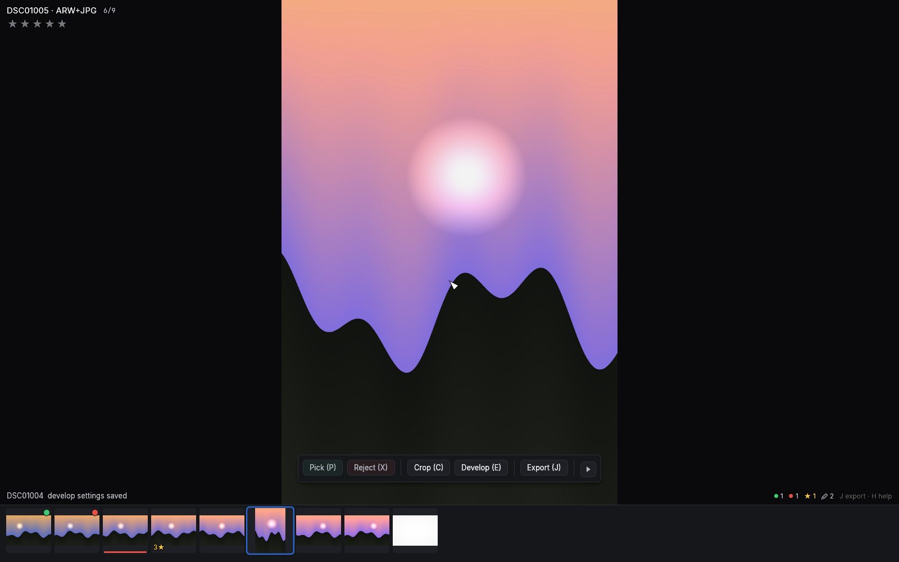
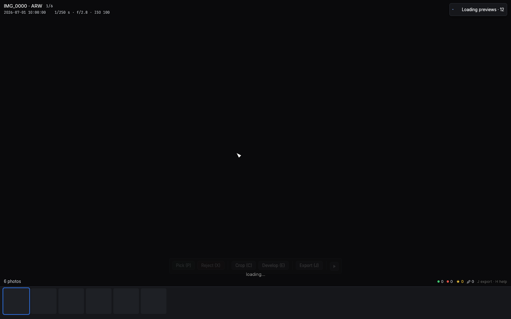
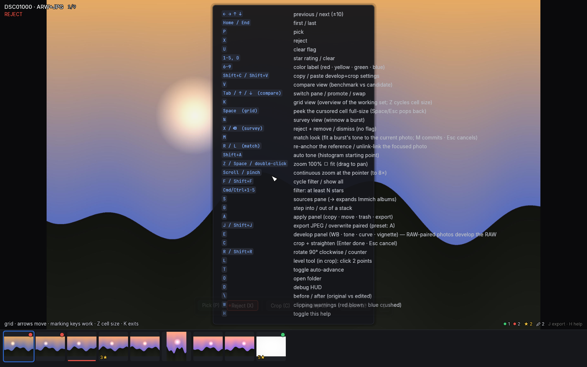

# Getting started

## Install and launch

culler is a single pure-Rust binary with no system dependencies:

```sh
cargo build --release
```

It runs on macOS and Windows (and Linux). Launch it on a folder, or with
no arguments to land on the [sources pane](06-sources.md) and pick a
saved folder or Immich server from there:

```sh
culler /path/to/photos
culler
```

### The Mac app

On macOS the same binary packages into a normal `culler.app` you can keep
in the Dock and send to other people:

```sh
scripts/package-macos.sh          # → dist/culler-<version>.dmg
```

Open the DMG, drag `culler.app` into Applications, launch it, and
right-click the Dock icon → Options → Keep in Dock. `UNIVERSAL=1` adds an
Intel slice (an Apple-silicon-only build won't launch on Intel Macs at
all); `SIGN_IDENTITY` and `NOTARY_PROFILE`/`APPLE_ID` upgrade the
signature and notarize if you have an Apple Developer certificate.

Two prompts are normal on a machine the app was *sent* to:

- macOS may refuse the first launch because it "cannot check it for
  malicious software". System Settings → Privacy & Security → scroll to
  the blocked-app notice → **Open Anyway**, once per copy. A notarized
  build (paid Apple Developer ID) skips this entirely.
- Sources on the Desktop, in Documents/Downloads, on SD cards or network
  drives may trigger a one-time folder-access prompt on the next launch —
  see [macOS folder permissions](06-sources.md#macos-folder-permissions).

A folder is scanned immediately: RAW and JPEG files with the same name
are treated as one photo, existing `.xmp` sidecars (yours or Lightroom's)
are read, and decoding starts around the first photo.

## The screen at a glance



- **The photo** fills the window, fitted. All text drawn over it carries a
  thin dark halo so it stays readable even on a blown-out sky
  ([example](img/07-bright-overlay.png)).
- **Top-left overlay**: filename, position in the current view (`3/128`),
  and mode tags such as the active filter, `[manual advance]`, `[stack]`
  or `[before]`. Below it: capture time and exposure info, then your
  stars, PICK/REJECT state, and stack size where relevant.
- **The filmstrip** along the bottom shows thumbnails with your culling
  state at a glance: a green dot for picks, red for rejects, a star count,
  and a colored bar for color labels. The accent ring marks the current
  photo. Crop, rotation *and develop edits* show live in the thumbnails.
- **Bottom-right counters**: whole-folder totals of picks, rejects, rated
  and edited photos, in the same colors as the filmstrip badges, plus a
  hint for `J` and `H`.
- **The status line** (bottom-left) narrates what just happened: the
  rating you set, an export finishing, a confirmation prompt.
- **The action dock** (bottom-center: *Pick · Reject · Crop · Develop ·
  Export · ▾*) appears when the mouse moves and fades away when your hands
  are on the keyboard. The **▾** opens a menu with everything else —
  Compare, Survey, Match Look, the live filter, Batch, Sources, Help —
  each row naming its keyboard key. In a narrow window the dock compacts to the
  bare keycap letters — hover any of them for the full name
  ([compact form](img/13-compact-dock.png)). See
  [culling with the mouse](02-culling.md#culling-with-the-mouse).
- **The system menu bar** (Mac app): everything above is also in the
  regular macOS menus — File, View, Photo, Window, Help — with each
  item naming its culler key, so the menu bar doubles as a shortcut
  reference. Quitting mid-session is always safe: an open Match Look or
  crop session is committed, never discarded.
- **The pending-work pill** (top-right) appears only while something is
  running against a server — syncing ratings, uploading, fetching
  previews. See [batch operations](07-batch-and-export.md#the-pending-work-pill).



Press `H` at any time for the built-in key overlay:



Now go cull something: [Culling](02-culling.md).
