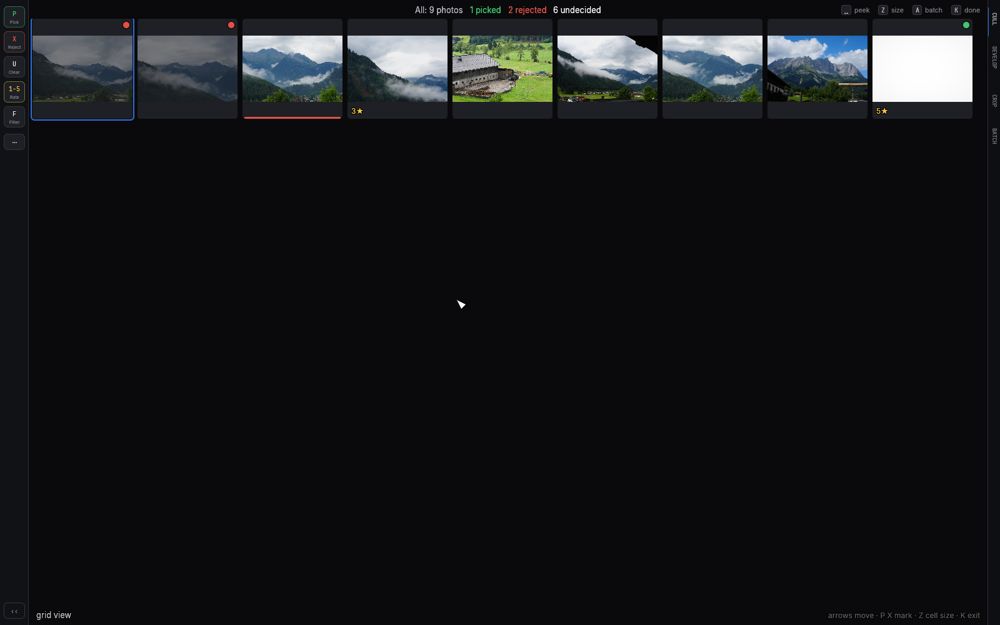
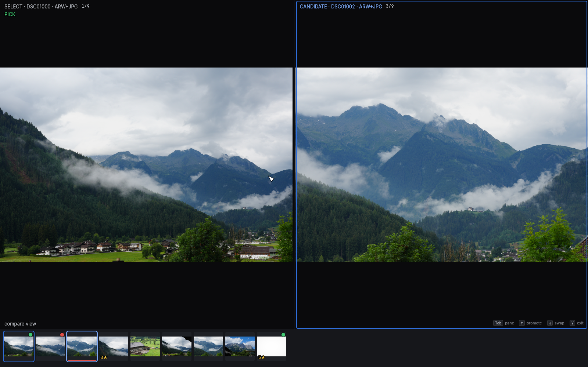
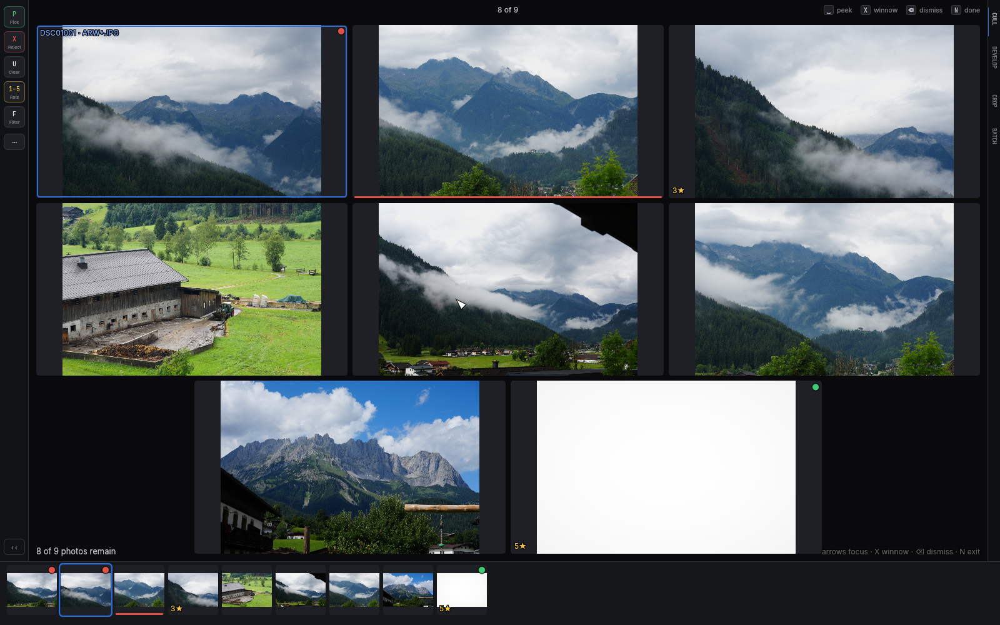

# Viewing and comparing

## Zoom

- `Z`, `Space`, or double-click toggle between fit and 100%. The zoom
  lands on the point under your pointer; with the pointer elsewhere, it
  centers on the camera's autofocus point when the EXIF carries one.
- **Scroll or pinch** over the photo zooms continuously (up to 8×),
  anchored at the pointer. Shrinking back to the fit scale snaps to fit.
- Drag to pan while zoomed. Full resolution decodes lazily on zoom — the
  view responds instantly (briefly soft) and sharpens when the full
  decode lands.

## Before / after: `\`

`\` toggles the untouched original — no tone, no crop, no rotation — and
tags the overlay `[before]`. Press again for your edit.

## Grid view: `K`

Zooming all the way out: `K` spreads the **whole working set** (the
current filter) across a scrolling grid, with a live tally at the top —
photos, picked, rejected, undecided — so one glance answers "where are
we?". Every cell wears the filmstrip's badges (flag dot, stars, color
bar), rejected photos dim so the undecided work pops forward, and
develop edits show in the cells.

| Key | Action |
| --- | --- |
| arrows | move the cursor a cell / a row |
| `Home` / `End`, `PgUp` / `PgDn` | jump to the ends / scroll a page |
| `P` `X` `U`, `0`–`5`, `6`–`9` | mark the cursored photo — writes immediately, and with auto-advance on the cursor walks on |
| `Z` | cycle the cell size (small / medium / large) |
| `Space` / double-click | **peek** the cursored cell full-size; `Space`/`Esc` pops back |
| `A` | the [batch panel](07-batch-and-export.md#the-apply-panel-a), in place — scope a copy/move/trash while the whole set is in view |
| `E` `C` `V` `N` `M` `S` | leave the grid, then act on the cursored photo |
| `Esc` / `Enter` / `K` | exit onto the cursored photo |

`Space` on the cursored cell **peeks** it full-size — a real loupe
render, not a bigger thumbnail, so `Z`/scroll/pinch zoom and drag pans
(the overlay says `[peek]`). `Space`, `Esc`, `Enter`, or `K` pops back
to the grid exactly where you left it; arrow keys keep flipping through
neighbors without leaving the peek, and marking keys work throughout.

The grid is **live but steady**: badges and edits update the instant you
mark, but a photo whose new flag would drop it from the active filter
stays on screen until you exit — nothing is ever yanked out from under
your cursor. Filter keys (`F`, `Cmd+1`–`5`) are inactive inside for the
same reason; exit, change the filter, come back.

## Compare view: `V`

Pick the best of two the Lightroom way. `V` pins the current photo as the
**Select** (left — your benchmark) and puts the next photo beside it as
the **Candidate**.

| Key | Action |
| --- | --- |
| `←` `→` | walk the Candidate through the current filtered view |
| `↑` | promote: the Candidate becomes the new benchmark, the next photo challenges |
| `↓` | swap the two sides |
| `Tab` (or click a pane) | move the focus ring — rating/flag/label keys hit the focused pane |
| `Z` / double-click | zoom both panes together, anchored at the same relative point |
| `Esc` / `V` | exit — the Select becomes the active photo |

Judging never auto-advances mid-comparison, and a photo whose new flag
would drop it from the active filter stays on screen until you exit — the
comparison is never yanked out from under you. Walking a burst is four
keys per photo: `→`, look, `↑` if it wins, repeat.

## Survey view: `N`

Winnow a burst on one screen. `N` lays up to 24 photos around your
position out in a grid; survivors grow as losers leave.

| Key | Action |
| --- | --- |
| arrows | move the focus ring through the grid |
| `X` | **reject and remove** — the flag is written, the grid reflows, and the next photo slides into the same cell so you can keep hammering |
| `⌫` | remove from the grid *without judging* (no flag written) |
| `1`–`5`, `P`, `U`, `6`–`9` | mark the focused photo (never removes it) |
| `Esc` / `N` | exit onto the focused survivor |

Winnowing all the way to zero exits by itself — rejecting an entire bad
burst is a legal outcome. Develop edits show in every cell.

There is a third multi-photo mode: **Match Look** (`M`) grades a frozen
burst as one, fitting every photo's tone to the one you're standing on.
It lives with the develop tools — see
[Match Look](04-develop.md#match-look-m).

Compare and Survey are both unavailable inside a
[stack](06-sources.md#stacks-g); step out first.
