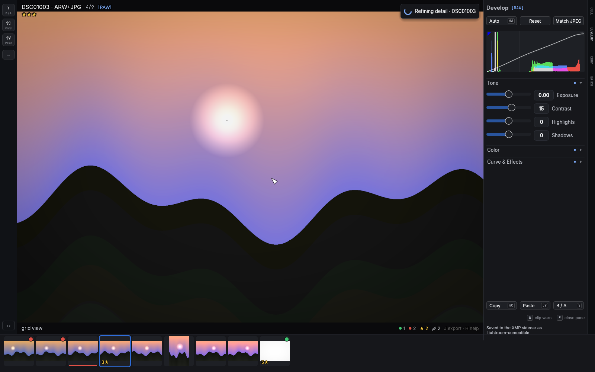
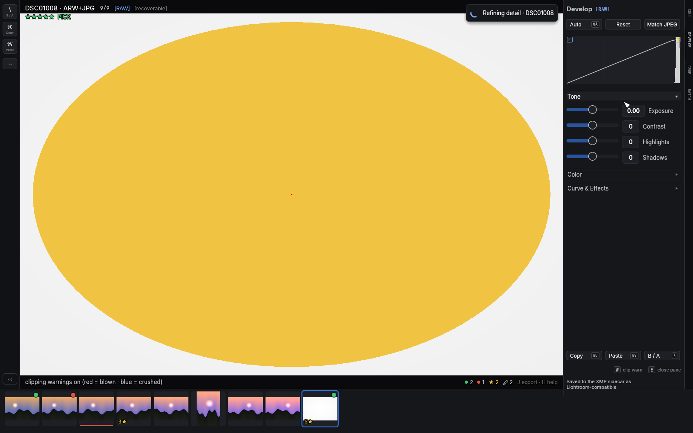

# Develop

`E` opens the develop panel. Its one-shot verbs sit right under the
title as a full-width quick row — **Auto**, **Reset**, and **Match
JPEG** on RAW-paired photos — and a footer row carries **Copy**,
**Paste** and **B / A** (the same actions as `Shift+C`, `Shift+V` and
`\`). While the panel is closed, resting the pointer on the DEVELOP
spine tab (right edge) offers Auto tone and Reset without opening the
panel at all. Adjustments render on the GPU, so every
slider is realtime at any image size, and everything persists to the XMP
sidecar in Lightroom's schema — Lightroom applies your edits on import.

## RAW-paired photos develop the RAW

Culling always shows the camera JPEG — but when a photo has a RAW file
beside it, opening the develop panel switches the image to a **fresh
demosaic of the RAW**, developed with the file's own white balance and
color matrix. A soft render appears near-instantly and sharpens in place
a moment later; close the panel and the **plain** JPEG is back — your
adjustments were graded against the flat RAW rendition, so they are
deliberately *not* re-applied to the already-cooked camera JPEG (they
would read overbaked there). The edits aren't lost: they live in the
develop panel and in [exports](07-batch-and-export.md), which bake from
the RAW — and a quiet `[edited]` tag in the top-left overlay row marks
any photo carrying RAW edits you can't currently see. Only the crop
follows you out of the panel: geometry means the same thing on both
files. The tag next to
the panel's title says which one you're looking at: **`[RAW]`** or
**`[JPEG]`** — it always describes the pixels actually on screen, so a
photo whose RAW is still decoding (or downloading) reads `[JPEG]` until
the real thing lands. The same moment, an accent-colored **`[RAW]`**
tag appears over the photo itself, in the top-left row next to
`[stack]` and `[before]` — inside a stack of mixed RAW and JPEG
members it appears and disappears per member as you step through, so
there's never a doubt about which file you're grading.

Expect the RAW to look different from the JPEG: flatter and often
darker. The camera's JPEG has its own cooked tone curve, sharpening and
lens corrections baked in; the RAW render is the neutral starting point
your adjustments build on (lens correction is applied from the file's
own parameters — see the slider list below). The histogram follows the same rule as the
tag — it describes whichever image is displayed.

Photos with no RAW (plain JPEG, HEIC) keep developing the JPEG exactly
as before, and a RAW that can't be decoded falls back the same way — the
tag tells the truth either way. On a server source the RAW original
downloads first ("Downloading RAW" in the pending-work pill); the panel
opens instantly on the server preview and the tag flips to `[RAW]` when
the real pixels land. The download is a one-time cost per photo.

**White balance becomes real in RAW mode.** On a JPEG, Temp and Tint
are relative nudges (−100..+100 around 0) — a JPEG has no true white
balance left to change. On a RAW, the Temp slider turns into an actual
**Kelvin** scale (2000–25000, log-spaced so the everyday 3000–9000 band
gets most of the travel) whose home position is the file's **As Shot**
white balance; hover the slider to see it, double-click to return to
it. Tint stays −100..+100, zero meaning As Shot. The number format is
the tell: "5500K" is a RAW, "+12" is a JPEG. The two settings are
stored separately per photo — RAW-mode edits write Lightroom's real
`crs:Temperature`/`crs:Tint` fields, JPEG-mode edits keep the
Incremental pair, and neither ever touches the other.

## The histogram is a control

The live RGB histogram at the top reflects your adjustments, and you can
grab it directly:

- Drag in the **left third** to move Shadows, the **middle** for
  Exposure, the **right third** for Highlights. The tone you press on
  tracks the pointer — it feels like dragging the histogram mass itself.
- **Double-click** a zone to reset that parameter.
- The histogram is computed over the **cropped region**, so it describes
  the photo you're actually keeping.

### The curve

The white line across the histogram is the **tone curve**: for every
input tone (left = black, right = white) it shows the tone your sliders
turn it into (bottom = black, top = white). Untouched, it lies on the
faint diagonal — except a small dip near white, the built-in highlight
shoulder that rolls bright pushes off softly instead of clipping them.
Raise Exposure and the whole line lifts; add Contrast and it steepens
into an S; pull Highlights and the top end bends down. While you drag a
tonal slider the line brightens to the accent color, and dragging one of
the four **Tone curve** sliders also thickens the stretch of the curve
that slider owns, so you can see exactly where "Darks" ends and "Lights"
begins. White balance, Vibrance/Saturation and Vignette don't move the
line — they change color or corners, not tones.

Hovering any slider and scrolling nudges it — slower than dragging, for
fine work.

## Sections

The sliders live in three collapsible sections — **Tone** (Exposure,
Contrast, Highlights, Shadows), **Color** (Temp, Tint, Vibrance,
Saturation) and **Curve & Effects** (the tone curve regions and
Vignette). Click a header to collapse or expand it; the app remembers
your arrangement across restarts. On a fresh install only Tone is open —
the every-photo section — keeping the pane compact. A collapsed section
can never hide an edit silently: a small accent dot on the header means
something inside is off its default.

## The sliders

- **Temp / Tint** — white balance: Temp seesaws red/blue (negative cools,
  positive warms), Tint moves the green–magenta axis. Neutral grays keep
  their brightness while the color shifts.
- **Exposure** — brightness in EV, in linear light, with a soft shoulder
  so pushed highlights bloom instead of clipping flat.
- **Contrast** — an S-curve around the midtones.
- **Highlights / Shadows** — recover the bright end or lift the dark end.
  Up to ±50 the effect follows each pixel's own tone; **beyond ±50 it
  becomes neighborhood-aware**: a strong shadow lift brightens a dark
  doorway without washing out the bright wall next to it, the way
  Lightroom's sliders behave at the extremes.
- **Vibrance / Saturation** — Vibrance boosts muted colors more than
  already-vivid ones (protecting what's already saturated); Saturation is
  uniform. −100 Saturation is black & white.
- **Tone curve** (Highlights / Lights / Darks / Shadows) — four regions
  of a parametric curve, for shaping after the basic tone is set: lift
  the darks a touch, ease the lights, without touching exposure.
- **Vignette** — post-crop corner darkening (0 to −100). It follows the
  crop, so the falloff is always centered on your final frame.
- **Lens correction** (RAW mode only) — a checkbox at the bottom of
  Curve & Effects, on by default whenever the RAW carries the camera's
  own correction data (Sony bodies bake per-shot distortion, chromatic
  aberration and vignetting parameters into every ARW — the same data
  the camera used for its JPEG, so no lens profiles to manage). With it
  on, the RAW's framing matches the corrected camera JPEG; turn it off
  to see the naked lens. Files without correction data show a quiet
  "no profile" note instead.

## Clipping warnings: `W`

`W` paints **clipping warnings** straight onto the photo: pixels blown
to white glow red, pixels crushed to black glow blue — Lightroom's
J-overlay, applied to the final render (so a heavy vignette can
legitimately warn in the corners). The histogram's top corners carry
small always-on indicators that light up whenever the current photo
clips (shadows left, highlights right); clicking one toggles the same
overlay, and while it's active they get an accent ring and the top
overlay shows `[clipping]`. The warnings are near-clip rather than
exact-255 — the develop pipeline's highlight shoulder deliberately
rolls pushed whites off before they hard-clip, and the warning
respects what your eyes actually get. Exports never include them.

**On a RAW render, blown isn't always gone.** The sensor usually keeps
detail past the point where the display clips, so in `[RAW]` mode the
warnings split: **gold** marks highlights that are blown on screen but
still recoverable — pull Highlights or Exposure down and real detail
comes back — while **red** stays reserved for pixels the sensor itself
clipped in the file. Even those pull down gracefully: where only some
color channels clipped (a bright sky almost always loses green first),
the missing channel is reconstructed from the surviving ones, so blown
whites come back as white — not the pink cast naive RAW converters
show — and only fully clipped pixels settle for neutral gray. Crushed
blacks stay blue in both modes. The histogram's highlight indicator and
the `[clipping]`/`[recoverable]` overlay tag follow the same split, with
red winning whenever any true sensor clip is present. The split exists
only while the RAW render is on screen — with the panel closed, `W`
describes the plain camera JPEG, so a sky can read blown while culling
yet recoverable the moment you press `E`. That's the two files talking,
not a bug.

## Auto tone: `Shift+A`

`Shift+A` (or the panel's **Auto** button) computes a starting point from
the histogram: exposure toward a balanced midtone, highlight/shadow
rescues where mass piles up at the ends, a touch of contrast for flat
frames. It is deliberately a nudge, not a look — and it only touches the
four tonal sliders. Your white balance, presence, curve and vignette
survive it. **Reset** clears everything.

## Match JPEG

**Match JPEG** (RAW mode only, in the button row next to Auto and Reset)
computes a starting point that approximates the paired camera JPEG's
look: it fits the RAW histogram onto the JPEG's. Three things are
fitted, all measured from this photo's own two renditions, never
guessed: the four tone sliders (histogram percentiles), **Saturation**
(cameras cook color well beyond the neutral matrix render — the fit
measures the actual chroma gap and accounts for how much of it the tone
push already restores), and **white balance** (the channel balance
difference between the two renditions of the same pixels; a near-zero
delta stays As Shot). Vibrance, the tone curve and Vignette carry over
unchanged, and Reset undoes everything. It's an approximation, not a
pixel match: the camera's hue twists and local contrast aren't
reproducible from histograms.
The button appears the moment real RAW pixels are on screen (the same
moment the `[RAW]` tag lights up); on a photo with no separate JPEG the
reference is the camera's embedded preview, and on a server source the
server-rendered preview.

## Match Look: `M`

**Match Look** grades a whole burst as one. Stand on the photo whose
look you like and press `M`: up to 24 photos around it freeze into a
set, the one you were on becomes the **reference**, and every other
photo is automatically fitted toward it — exposure, contrast and the
two tail rescues, each from its own starting point. The fit reads each
frame's histogram *and* its EXIF exposure settings, so a frame shot a
stop darker (faster shutter, smaller aperture) gets the physical
correction, while a frame where the scene genuinely changed (a shadow
crossing, more sky) is only nudged, never forced — a sudden shadow is
real, not a mistake.

While the mode is on, the develop panel edits the **reference**, and
every slider move carries the whole linked set with it — each photo
keeping its own hidden offset, so the group shifts together instead of
snapping to identical numbers. Walk the set with `←`/`→` (the filmstrip
marks the reference with a solid accent ring), check any photo against
its original with `\` ([screenshot](img/17-match-look.png)), and:

- `R` makes the focused photo the new reference (everything re-fits).
- `L` unlinks the focused photo — its sliders are its own from there —
  or links it back. Unlinked members wear a thin **amber ring** in the
  filmstrip (the reference's ring is solid blue; linked members have
  none). A RAW-paired photo that already carries a develop grade starts
  unlinked, so the automatic fit can never overwrite deliberate work;
  `L` opts it in.
- `P`/`X`/ratings/labels still work on the focused photo — a bad burst
  frame gets rejected without leaving.

RAW-paired members' filmstrip thumbnails warm up once per session — a
few seconds, one at a time (the pending pill counts them: *"Preparing
thumbnails"*) — into live renders that track every slider move, so a
matched burst visibly matches without leaving the panel. They revert
to their normal plain thumbnails the moment the session ends.

The panel itself changes shape for the session: a quiet
`reference: <name>` line under the heading always names the photo
driving the set, **Auto** and **Match JPEG** step aside (they'd drag
the whole group through an unrelated fit), and the buttons become
**Reset all** — every photo back to its freshly-matched state, without
leaving the mode — and **Re-match**, which runs the automatic fit
again. If a photo's fitted tone hits a slider's end of travel, it
stops tracking the group on that axis: a small amber dot appears in
its thumbnail corner and a `[clamped]` tag joins the panel header
while it's focused — drag back toward center and it reconnects.

**Nothing is written until you decide**: `M` again commits — every
changed photo's sidecar is written once — and `Esc` cancels, restoring
every photo exactly as it was. It's the same "starting point, not a
pixel match" honesty as Match JPEG: the fit gets the set close, your
eyes make the call.

## Copying settings across photos: `Shift+C` / `Shift+V`

`Shift+C` copies the current photo's develop settings *and* crop
(including rotation); `Shift+V` pastes them onto the current photo. A
burst shot in identical light becomes one keystroke per frame.

## Where it all lives

Edits are stored per photo in its sidecar as `crs:` fields (the full list
is in the [reference](08-reference.md#xmp-fields)) and never touch the
image file. For photos developed on their JPEG, filmstrip thumbnails
re-render with your tone baked in, so edited photos are recognizable at
a glance; RAW-paired photos keep plain thumbnails (same reason their
culling view stays plain) and announce their edits through the
`[edited]` overlay tag instead. The Edited filter
([culling](02-culling.md#filters-working-in-passes)) collects both
kinds. To turn an edit into an actual JPEG, see
[export](07-batch-and-export.md#single-export-j-and-overwrite-shiftj).
