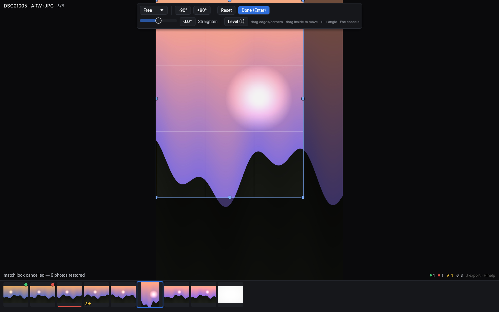
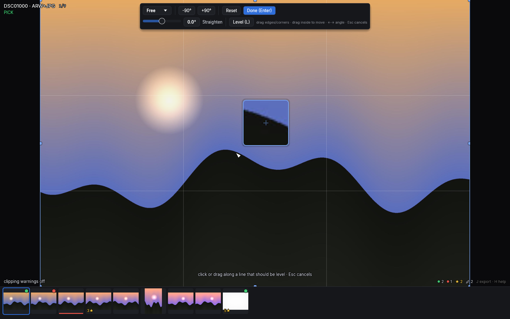

# Crop, rotate and straighten

`C` enters crop mode: the full photo is shown with your crop window over
it, a rule-of-thirds grid, and a floating toolbar.

## The crop window

- Drag any of the 8 corner/edge handles to resize; drag inside the window
  to move it.
- The **aspect picker** locks a ratio: Free, original, 1:1, 3:2, 4:3,
  16:9 — matched to the photo's orientation, with the `⇄` button to cut a
  portrait crop from a landscape photo or vice versa. Switching aspect
  re-fits your existing crop around its center instead of resetting it.
- **Enter** or `C` applies; **Esc** cancels and restores what you had
  when you entered. (Adjustments write live while you work, so leaving
  the app mid-crop loses nothing.)

## Rotation

- `R` / `Shift+R` rotate 90° clockwise / counter-clockwise — these also
  work *outside* crop mode, so a sideways photo is a one-key fix while
  culling. The toolbar has matching `-90°`/`+90°` buttons.
- The **Straighten** slider covers fine angles up to ±45°. In crop mode
  the arrow keys nudge it by 0.1°, `Shift+arrows` by 1°.
- Straightening auto-fits the crop so blank corners can never appear, and
  rotated photos cost nothing to display — thumbnails show crop and
  rotation live.

## The Level tool: `L`

For horizons and doorframes, skip the slider: press `L` in crop mode,
then click (or press-drag-release) two points that should form a level
line. The photo rotates by exactly the required angle. Lines closer to
vertical level to vertical, so a wall works as well as a horizon.

While you aim, a **6× loupe** floats beside the pointer with a crosshair
on the exact pixel you're on — precise placement without your own cursor
hiding the spot. It flips sides at the panel edges and always reflects
your current develop settings.

`Esc` while the Level tool is armed backs out of the tool only; a second
`Esc` cancels crop mode itself.

## Where it lives

Crop and straighten persist in Lightroom's own schema
(`crs:CropLeft/Top/Right/Bottom`, `crs:HasCrop`, `crs:CropAngle`);
quarter turns use a culler-specific field since Lightroom treats 90°
rotation separately. Cropped photos count as "edited" for the Edited
filter, and exports render exactly what you framed
([export](07-batch-and-export.md)).
