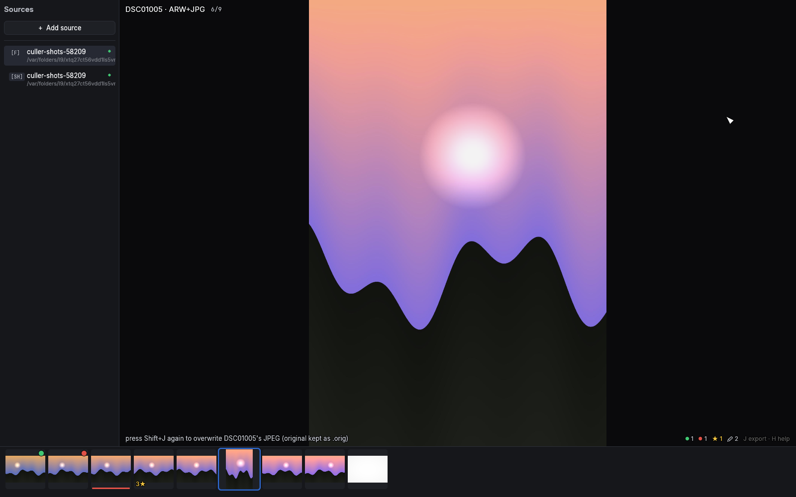

# Sources

`S` opens the sources pane: the saved places you cull from. While it's
open it owns the keyboard — `↑`/`↓` select, `Enter` opens, `Esc` closes.

## Folders, cards and shares

- **+ Add source** (or `N`) adds a local folder, a network share, or an
  SD card — mounted volumes with a `DCIM` folder are auto-detected and
  named after the card.
- Cards, shares and servers get a deeper prefetch window and more decode
  workers, since their latency, not your CPU, is the bottleneck.
- Folders opened from the command line or with `O` stay ad-hoc — they are
  never silently saved. Add them explicitly if you want them to stick.
- `Backspace` removes the selected source: the first press arms (the row
  turns red), the second confirms. Only the registry entry is removed —
  your photos and sidecars are untouched.
- Each source remembers your position and filter, so switching back
  resumes where you left off.

### macOS folder permissions

The first time you add a source, macOS's folder picker grants access
automatically. If that folder lives on your Desktop, in
Documents/Downloads, on an SD card, or on a network drive, macOS may ask
again the *next* time you open culler — that's expected: the system is
re-confirming direct access outside the picker, not reporting a bug.
Click Allow (or approve it under System Settings → Privacy & Security →
Files and Folders) and it won't ask again for that folder.

## Immich

Add an Immich server with its URL and an API key; **Test & add** checks
both against the server before saving. The key goes into the OS keychain
(macOS Keychain / Windows Credential Manager), not into a file on disk.

Culling a server works exactly like culling a folder — the server renders
the previews, culler streams them through a local disk cache (revisits
are instant), and the keys are the same. Opening a big timeline is
immediate: the first thousand photos appear within about a second and
you can start culling right away while the rest stream in behind them
(the pending-work pill counts them up; new photos append at the end,
and the library settles into capture-time order once everything has
arrived, without moving the photo you're on). If some pages fail to
load — a straining server, a network blip — culler keeps everything
that arrived and the pill tells you how much is missing and how to
retry; you never lose a loaded timeline to one bad request. Videos are
left out: culler is a photo culler.

RAW+JPEG shot pairs that live on the server as two separate assets are
culled as **one photo**, exactly like a local folder pairs them: the
camera JPEG is what you see, the overlay says so ("DSC09 · ARW+JPG" —
every remote photo shows its file kind there), and whole-photo actions
(rating, archive, trash, download) cover both assets. Server-side
stacks are a different thing — distinct shots grouped behind a cover —
and keep their own badge, count and `G` step-into.

The difference from a folder is where state goes:

### Write-through sync

Ratings, picks and labels write through to the server as you press the
keys: picks become Immich favorites, stars become the server rating. A
failed write retries on its own; while anything is queued or failing, the
[pending-work pill](07-batch-and-export.md#the-pending-work-pill) says
so. Develop settings and crops stay local — they travel only when you
export or upload ([edit round-trip](07-batch-and-export.md#edit-uploads-on-a-server-source)).

### Albums

Press `→` on an Immich row (or click its ▸ chevron) to expand the
server's albums as indented sub-rows with their photo counts; `←`
collapses (from an album row it also jumps back to the parent). Open an
album with `Enter` to cull just that album.

An album is a *view*, not a separate library: same photos, same state. A
rating you set inside an album is simply there when you reopen the full
timeline, previews already fetched don't re-download, and each album
remembers its own position and filter. Album lists are fetched fresh per
session (albums change on the server); if the fetch fails, the row says
so and `→` retries. `Backspace` does nothing on an album row — albums are
server objects, and culler won't delete those from a list pane.

### Stacks: `G`

Stacked assets (RAW+JPEG groups, edit versions) show their cover with a
member-count badge. `G` steps into the stack — the members become the
view — and `G` or `Esc` steps back out. Rejecting inside a stack stays
local until you archive or trash via the
[apply panel](07-batch-and-export.md); some actions (Compare, Survey,
the apply panel itself) are unavailable inside a stack.
