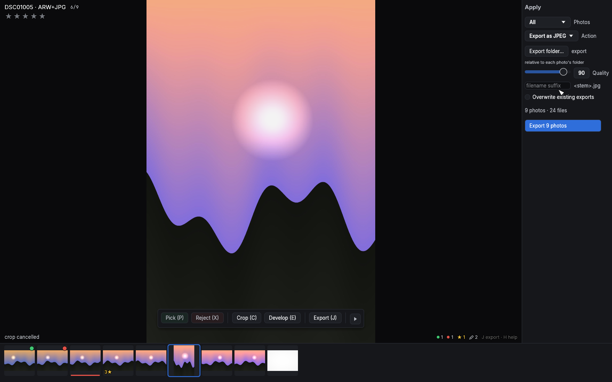
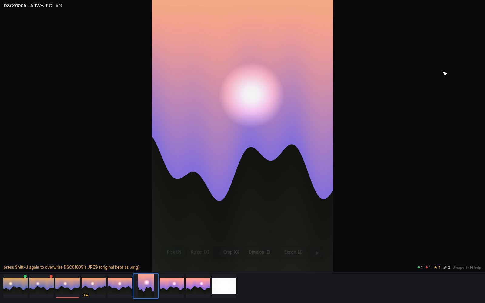

# Batch operations and export

## The apply panel: `A`

`A` opens the apply panel: pick a **scope** (Rejects, Picks, Unrated,
**All but rejects** — the survivors of a cull, everything you didn't
throw out — or All), an **action**, and run it. Every action treats
RAW + JPEG + sidecar as one unit — a moved photo takes its ratings
with it.

The actions adapt to the active source:

- **Local folders**: Copy to folder, Move to folder, Delete to trash
  (arm/confirm — the button asks for a second click), Export as JPEG,
  and **Upload to Immich** when a server is configured.
- **Immich sources**: Download to folder (each photo lands with a sidecar
  carrying your edits), Archive on server, and Delete to trash on the
  server (same two-click confirm).

**Upload to Immich** sends RAW+JPEG pairs (stacked on the server, sidecar
included so ratings import) and offers an **Album** destination — the
default, *No album (timeline only)*, is plain upload; choosing an album
adds every uploaded file to it, and the completion summary names it.
If the album list can't be fetched, the panel says so (with a **Retry**
button) instead of loading forever, and uploading to the timeline keeps
working regardless.
Uploading **copies**: your local files stay. A "move" variant (trash
locals after upload) is deliberately not offered yet — it would delete
your only local copy based on a server response that some Immich versions
get wrong for duplicates, so it waits until that success signal can be
verified.

## Single export: `J` — and overwrite: `Shift+J`

`J` renders the current photo's edits (tone + crop) at full resolution
through the same GPU pipeline that draws the screen — the file is
pixel-identical to what you see — and writes a JPEG using the export
preset (folder, filename suffix, quality, overwrite policy). For a
photo with a RAW file, the export comes from a fresh full-resolution
**demosaic of the RAW** (color, lens correction and your white balance
included), exactly like the [develop panel](04-develop.md#raw-paired-photos-develop-the-raw)
shows it; photos without a RAW export from the JPEG as before. Edit the
preset in the apply panel under *Export as JPEG*; it persists between
runs. Exports keep the camera's EXIF (MakerNotes intact), with
orientation and pixel dimensions corrected for your crop.

`Shift+J` replaces the paired **camera JPEG** in place with the rendered
edit — the one destructive file operation in the app. It asks for a
second press and keeps the original as `<name>.JPG.orig`. What happens
to your settings afterwards depends on what they were grading: a photo
developed on its **JPEG** has its develop and crop reset — those edits
are baked into the very pixels the sliders acted on, and left up they
would apply twice. A **RAW-paired** photo keeps its develop sliders:
they grade the RAW, which the overwrite never touches, so reopening the
develop panel shows the exact grade that produced the new JPEG. The
crop resets in both cases — the new JPEG is already cropped.

## Edit uploads on a server source

On an Immich source, `J` downloads the original, renders your edit
locally and **uploads** it — a RAW original gets the same full demosaic
treatment as a local one.
The edit is always **stacked with its original**: a photo that wasn't in
a stack founds a new one (edit on top, original behind it), and inside
an existing [stack](06-sources.md#stacks-g) the edit becomes the new
**stack cover** — either way the server timeline shows your version
fronting the original. The edit carries the original's metadata: camera,
lens, exposure, GPS and the local capture time ride along even when the
original is a format culler can't decode itself (an iPhone HEIC, say),
so the server's Info panel reads the same on both. From an
[album view](06-sources.md#albums), the edit also joins that album. Only
one export/upload runs at a time — a second `J` tells you one is already
running and points at the pill.

## The pending-work pill

Anything running against a server shows in a small pill at the top-right:
syncing ratings, a batch with its live `3/12` progress, an upload by
name, a stack loading, previews downloading. Hover it for the full list.
It exists to explain two things: why the app might feel slow right now
(the wait is on the wire, not in the app), and why an action was just
refused — a blocked keypress flashes the pill to point at the operation
in its way. A failing sync shows here too, in amber, with the server's
error; it keeps retrying on its own. When nothing is pending, the pill
doesn't exist — a local session never shows it.

